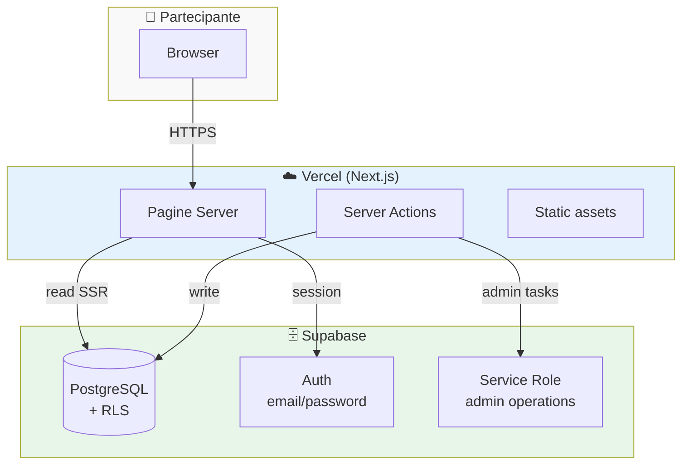

# Fantacalcio Boccea — Sorteggio Rose 2026/27

Webapp per la gestione della lega FC Boccea (Mantra). Strumento per **sorteggiare automaticamente le rose** dei 10 partecipanti in modo equo e trasparente, con preferenze (wishlist) configurabili.

## Strategia

Il progetto ha pivotato dall'asta eBay-style verso un **draft automatico**. Motivi:
- Difficoltà a riunire 10 persone live
- Tempi infiniti per finire l'asta
- Voglia di partire subito con la rosa "pronta" e gestire il fantacalcio normale su fantacalcio.it

Risultato: ognuno compila una **wishlist** (max 30 giocatori), il sistema esegue un sorteggio bilanciato per Quotazione che rispetta le preferenze quando possibile, ma garantisce equità totale.

## Stack

- **Frontend:** Next.js 15/16 App Router, TypeScript, Tailwind CSS v4
- **Backend/DB:** Supabase (PostgreSQL + Auth + RLS)
- **Deploy:** Vercel (CI/CD via GitHub master branch)

## Funzionalità principali

### 1. Sorteggio rose automatico
- **Algoritmo**: greedy best-of-100. Genera 100 candidati, sceglie quello con minor range Quotazione totale tra squadre (tipicamente ~2-5 punti)
- **Portieri** raggruppati per squadra Serie A: chi pesca Roma riceve tutti i portieri della Roma. Bilanciamento sul top GK FVM
- **Outfield** distribuiti globalmente per Quotazione desc — top player sempre a team diversi
- **Multi-ruolo Mantra**: se il ruolo primario è pieno, fallback su secondario/terziario (es. Cabal `[B, Dd, E]` scala a Dd se B saturo)
- **Timer atomico**: programmato dall'admin, eseguito server-side allo scadere. Nessun preview prima del lock
- **Reveal in diretta**: pagina pubblica con animazione svelamento giocatori per Quotazione decrescente

### 2. Wishlist preferiti (Opzione 2)
- Ogni partecipante seleziona giocatori preferiti (max 30, configurabile per ruolo)
- **Effetto sul sorteggio**: a parità di Quotazione vince chi ha il giocatore in wishlist
- **Cap media auto**: la wishlist applica solo se il team è sotto la media corrente — chi accumula top non sfora
- **Cap Quotazione esplicito** (configurabile admin): limite superiore alla somma FVM wishlist
- **Conflitti tracciati**: quando ≥2 team hanno lo stesso giocatore in wishlist, penalty cumulativa per chi vince conflitti consecutivi
- **Portieri**: solo i top GK per squadra Serie A sono opzionabili (coerente col raggruppamento)
- **Ruolo elettivo dinamico**: l'UI mostra in tempo reale quale slot occuperà ogni giocatore (greedy FIFO sull'ordine di selezione)

### 3. Multi-utente per team
- Più persone possono gestire la stessa squadra (tabella `team_members`)
- Ogni membro ha login personale ma vede/modifica la stessa rosa e wishlist
- Utile per team co-gestiti tipo "Madau & co."

### 4. Self-service partecipanti
- **Registrazione** `/register`: chiunque può creare un account
- **Cambio password** `/account`: ogni utente gestisce le proprie credenziali
- **Dashboard rose**: tab per ogni squadra (propria evidenziata) + svincolati, raggruppati per ruolo Mantra con Quotazione totale

### 5. Admin
- **Import Excel** da fantacalcio.it (upsert per Id)
- **Configurazione wishlist**: abilita/disabilita, max totale, max per ruolo, cap FVM
- **Gestione squadre**: crea/modifica/elimina, dropdown utenti registrati senza team
- **Gestione utenti orfani**: lista con origine (self-registered vs admin-created), date, cancellazione
- **Reset rose**: bottone d'emergenza per riportare tutti i giocatori a svincolati
- **Statistiche wishlist** (privacy-safe): solo aggregati per team (conteggio + Quotazione totale), nessun dettaglio dei giocatori scelti

## Setup locale

```bash
git clone https://github.com/leonepigro/bocceasta
cd bocceasta
npm install

cp .env.local.example .env.local
# Inserisci le credenziali Supabase in .env.local

npx supabase login
npx supabase link --project-ref <project-ref>
npx supabase db push

npm run dev
```

## Variabili d'ambiente

```
NEXT_PUBLIC_SUPABASE_URL=https://xxxx.supabase.co
NEXT_PUBLIC_SUPABASE_ANON_KEY=eyJ...
SUPABASE_SERVICE_ROLE_KEY=eyJ...
```

## Primo avvio

1. Crea account admin su Supabase → Authentication → Users → Add user
2. Imposta ruolo admin nel SQL Editor:
   ```sql
   UPDATE auth.users
   SET raw_user_meta_data = raw_user_meta_data || '{"role": "admin"}'
   WHERE email = 'tua-email@example.com';
   ```
3. `/admin` → Import Excel → carica file da fantacalcio.it
4. Manda link `/register` ai partecipanti per auto-registrazione
5. Admin → Squadre → "Lega utente registrato" per associarli ai team
6. Configura wishlist (max giocatori, cap FVM)
7. I partecipanti compilano la wishlist via `/preferiti`
8. Admin → Sorteggio rose → Programma sorteggio (timer atomico)
9. Allo scadere: rivela in diretta sulla pagina pubblica
10. Applica rose al sistema

## Modello sorteggio

| Parametro | Default |
|---|---|
| Squadre Bocceasta | 10 |
| Portieri per squadra | tutti quelli delle 2 squadre Serie A assegnate |
| Outfield per squadra | ~44 (floor distribuzione equa) |
| Wishlist max giocatori | 30 (configurabile) |
| Wishlist max per ruolo | Por=1, Dc=4, B=2, Dd=2, Ds=2, E=2, M=3, C=3, T=2, W=3, A=3, Pc=3 |
| Cap FVM wishlist | 0 = usa media auto, oppure valore esplicito |
| Best-of-N candidates | 100 |
| Penalty conflitto vinto | +50 FVM per ranking successivi |
| Range FVM atteso | < 30 punti tra top e bottom team |

## Ruoli Mantra

Caricati dall'Excel (colonna RM):
- **Portieri**: `Por`
- **Difensori**: `Dc` (centrale), `B` (braccetto), `Dd` (destro), `Ds` (sinistro)
- **Esterni**: `E`
- **Centrocampisti**: `M` (mediano), `C` (centrale)
- **Trequartisti**: `T`, `W` (ala)
- **Attaccanti**: `A`, `Pc` (centravanti)

Combinazioni multi-ruolo: `Dd;Dc`, `B;Dd;E`, ecc.

## Privacy wishlist

- Le wishlist sono **private** fino al sorteggio
- L'admin vede solo aggregati per team (conteggio + Quotazione totale, niente nomi giocatori)
- RLS PostgreSQL impedisce ad altri utenti di leggere wishlist altrui
- A sorteggio eseguito: la pagina pubblica mostra l'elenco conflitti wishlist (giocatore conteso, partecipanti coinvolti, vincitore)

## Roadmap

Strumento operativo. Possibili evoluzioni:
- Integrazione fantacalcio.it: push rose post-sorteggio
- Gestione presenze giornata
- Dashboard scontri/classifica condivisa con la lega

## 🏟️ Self-hosting per la tua lega

Vuoi usare Bocceasta per la tua lega di amici? Fai un fork e deploya in 30 minuti — istanza isolata, dati tuoi, zero costi (free tier Supabase + Vercel coprono tutto).

👉 **[Guida completa: deploy nuova lega](docs/DEPLOY_NEW_LEAGUE.md)**

### Diagramma flusso deploy

```mermaid
flowchart LR
    A[🍴 Fork repo<br/>GitHub] --> B[🗄️ Nuovo progetto<br/>Supabase]
    B --> C[📝 Esegui migration<br/>SQL Editor]
    C --> D[👤 Crea admin<br/>+ ruolo]
    D --> E[🚀 Deploy Vercel<br/>+ env vars]
    E --> F[📥 Import Excel<br/>fantacalcio.it]
    F --> G[👥 Onboarding<br/>partecipanti]
    G --> H[⚙️ Config wishlist<br/>+ sorteggio]

    style A fill:#24292e,color:#fff
    style B fill:#3ECF8E,color:#fff
    style C fill:#3ECF8E,color:#fff
    style D fill:#3ECF8E,color:#fff
    style E fill:#000,color:#fff
    style F fill:#c0392b,color:#fff
    style G fill:#c0392b,color:#fff
    style H fill:#e8a020,color:#fff
```



### Architettura runtime



### Costi stimati (free tier)

| Servizio | Free tier | 1 lega usa |
|---|---|---|
| Supabase DB | 500 MB | ~5 MB (1%) |
| Supabase MAU | 50.000 | ~10 utenti (0.02%) |
| Vercel bandwidth | 100 GB/mese | ~1 GB (1%) |
| Vercel build min | 6.000/mese | ~20 min (0.3%) |

**Tradotto**: 1 deploy free regge tranquillamente 50+ leghe contemporanee senza spendere un euro.
